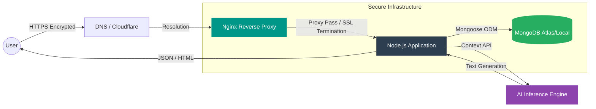
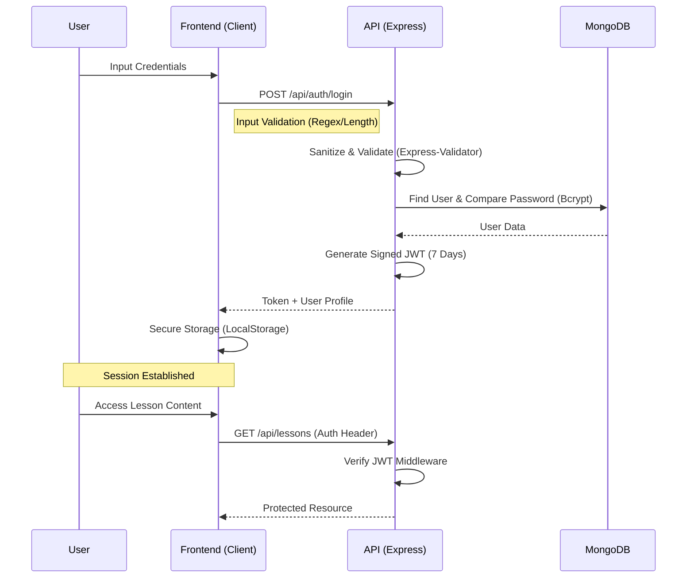

# TurkAmerica - Turkish Learning Platform

[](https://www.sonarqube.org/)
[](https://nodejs.org/)
[](https://www.mongodb.com/)
[](https://opensource.org/licenses/MIT)

> **TurkAmerica** is a high-performance educational platform engineered to bridge the linguistic gap for Spanish speakers learning Turkish. This project utilizes a sophisticated hybrid architecture, merging the lightning-fast performance of Static Site Generation (SSG) with the robustness of a scalable RESTful API. It integrates context-aware Artificial Intelligence to deliver a personalized, adaptive learning experience that evolves with the user.

---

## System Architecture

The ecosystem relies on a containerized microservices architecture, ensuring that every component is isolated, scalable, and secure by design.



### Core Components

1.  **Static Frontend (Eleventy Integration)**: The visual core is pre-rendered using **11ty** (Eleventy). This approach eliminates server-side rendering latency, drastically improving SEO, Time to First Byte (TTFB), and First Contentful Paint (FCP) metrics.
2.  **Enterprise-Grade REST API (Express.js)**: Manages dynamic business logic with a focus on security and maintainability:
    *   **Authentication & Authorization**: A robust system utilizing JWT (JSON Web Tokens) and OAuth2 (Google) policies.
    *   **State Management**: Complex tracking of user progress, adaptive curriculum unlocking, and study streaks.
    *   **Security Layer**: Implementation of `Helmet` for strict HTTP headers, Content Security Policy (CSP), and `express-rate-limit` to mitigate DDoS and brute-force vectors.
3.  **Design System (TailwindCSS)**: Deploys a utility-first design framework with a custom configuration (`tailwind.config.js`) to ensure strict visual consistency, responsive behavior across devices, and native dark mode support.

---

## Data Pipelines

### Authentication & Session Lifecycle

The following sequence diagram illustrates the secure authentication flow implemented within `/server/routes/auth.js`, adhering to industry best practices for credential handling.



---

## DevOps Strategy & Continuous Deployment

We implement a streamlined yet robust CI/CD pipeline powered by automated shell scripting (`deploy.sh`) and process orchestration via PM2, ensuring zero-downtime deployments.

```mermaid
graph TD
    Dev[Developer]
    Git[Git Repository]
    Server[Production Server]
    Build[Build Pipeline]
    PM2[PM2 Process Manager]

    Dev -->|Push Commit| Git
    Git -->|Webhook / Manual Trigger| Server
    
    subgraph "Production Environment"
    Server -->|Git Pull & Reset| Git
    Server -->|"NPM CI (Prod Dependencies)"| Build
    Build -->|Eleventy Build| StaticFiles[Static Assets (_site)]
    Build -->|Tailwind Minify| CSS[Optimized CSS]
    StaticFiles --> PM2
    CSS --> PM2
    PM2 -->|Graceful Reload| Online[Active Service]
    end

    style PM2 fill:#e74c3c,stroke:#fff,color:#fff
    style Build fill:#3498db,stroke:#fff,color:#fff
```

### Quality Assurance & Security Compliance

This codebase has been audited to meet professional development standards:

*   **SonarQube Compliance**: The code has passed static analysis for security hotspots, code smells, and technical debt.
*   **Dependency Integrity**: Strict usage of `npm ci` in production environments ensures that the deployed dependency tree matches the tested environment exactly (determinism).
*   **Input Sanitization**: All incoming data streams undergo rigorous sanitization via `mongo-sanitize` (to prevent NoSQL Injection) and `xss-clean` (to neutralize Cross-Site Scripting attacks).
*   **Error Handling**: A centralized global error handler masks stack traces in production, preventing sensitive information leakage.

---

## Detailed Tech Stack

| Domain | Technologies & Libraries | Purpose |
| :--- | :--- | :--- |
| **Backend** | `Node.js`, `Express` | High-performance server runtime and framework |
| **Database** | `MongoDB`, `Mongoose` | Scalable NoSQL persistence and strict schema modeling |
| **Security** | `Helmet`, `BcryptJS`, `JWT`, `Cors` | Endpoint hardening, hashing, and access control |
| **Frontend** | `Eleventy`, `Nunjucks` | Ultra-fast Static Site Generation (SSG) |
| **Styling** | `TailwindCSS`, `PostCSS` | Utility-first CSS framework with post-processing |
| **Infrastructure** | `PM2`, `Docker` | Process orchestration and containerization |
| **Validation** | `Express-Validator` | Type-safe input validation and sanitization |

---

## License

This project is distributed under the **MIT License**. Please refer to the `LICENSE` file for further details.

---

**Developed by Alejandro @ ODL**