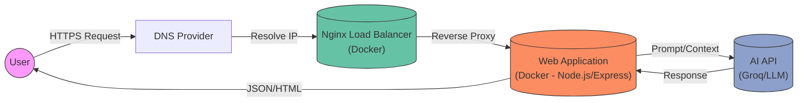

# 🇹🇷 TurkAmerica - Turkish Learning Platform

A comprehensive web platform designed for Spanish speakers to learn Turkish effectively. This project integrates a robust backend with a static-site generated frontend to deliver a fast, interactive, and personalized learning experience, complete with authentication, progress tracking, and AI-powered assistance.

## Architecture

The infrastructure allows for secure and scalable interactions, handling user traffic efficiently from the request entry point to the core application logic and external AI services.

### System Flow
1.  **User Interaction**: The user accesses the platform via a web browser.
2.  **DNS & Routing**: The request is resolved by the DNS provider and directed to the configured server.
3.  **Entry Point (Nginx)**: An Nginx container acts as a reverse proxy, handling SSL termination and forwarding traffic to the main application container.
4.  **Core Application**: The application (built with Node.js/Express and optimized by Eleventy) processes the request. It handles authentication, retrieves data from MongoDB, or renders pages.
5.  **AI Integration**: For chatbot features, the application securely communicates with an external AI API (Groq) to process natural language queries and provide context-aware responses.

##  Project Contribution & Value

This project aims to bridge the language gap for Spanish speakers learning Turkish by providing:

*   **Structured Learning Path**: A curriculum organized by Common European Framework of Reference for Languages (CEFR) levels (A1-C1).
*   **Contextualized AI**: An AI assistant ("Capi") that understands the specific context of the lessons and user progress, offering help beyond generic translation.
*   **Community Focus**: By open-sourcing this platform, we contribute to the educational technology community, providing a reference architecture for building language learning apps with modern web technologies.

##  Features

### **Educational Resources**
- **Level-Based Content**: Structured lessons ranging from A1 (Beginner) to C1 (Advanced).
- **Interactive Grammar**: Dynamic explanations and exercises to master Turkish grammar rules.
- **Curated Media**: Integration with official resources (Yunus Emre Institute) and selected YouTube channels.

### **User System**
- **Secure Authentication**: JWT-based login and registration system.
- **Progress Tracking**: Personal dashboard tracking completed lessons and "study streaks" to encourage consistency.
- **Custom Profiles**: User avatars and profile management.

### **Modern Interface**
- **Responsive Design**: Fully adaptable layout for desktop, tablet, and mobile devices.
- **Dark Mode**: Native dark mode support for visual comfort.
- **Performance**: Static site generation (SSG) for lightning-fast page loads.

##  Tech Stack

This project leverages a modern JavaScript stack to ensure performance and developer experience.

### Backend
- **Node.js & Express**: The core server framework handling API routes and middleware.
- **MongoDB & Mongoose**: NoSQL database for flexible data modeling (Users, Progress, Contributions).
- **JWT**: Stateless authentication mechanism.
- **Groq SDK**: Integration with high-performance AI models.

### Frontend
- **Eleventy (11ty)**: Static Site Generator for optimal performance and SEO.
- **HTML5 & CSS3**: Semantic markup and modern styling.
- **TailwindCSS**: Utility-first CSS framework for rapid UI development.
- **JavaScript (ES6+)**: Vanilla JS for client-side interactivity without framework overhead.

### Security
- **Helmet**: Secures HTTP headers.
- **CORS**: Configures resource sharing policies.
- **Rate Limiting**: Prevents abuse and DDoS attempts.
- **Input Sanitization**: Protects against XSS and injection attacks.

## License

This project is licensed under the MIT License - see the [LICENSE](LICENSE) file for details.

## Author

**LatinCTC**
- GitHub: [@LatinCTC](https://github.com/LatinCTC)
- Email: contact@turkamerica.com

---

**Made with ❤️ by Alejandro from ODL**